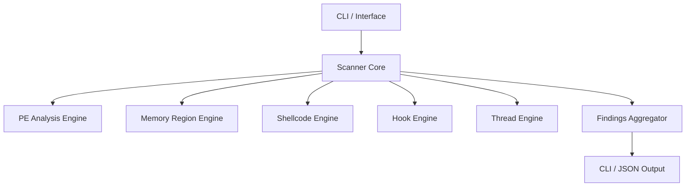

# 🚀 ProcessVision – Advanced Process Memory Threat Detection

ProcessVision is a next-generation process memory inspection and threat detection tool written in Rust. It is designed for blue teams, incident responders, and malware analysts to detect sophisticated in-memory threats without relying on signatures.

## 🎯 What is ProcessVision?

ProcessVision performs deep structural and behavioral analysis of live processes to identify malicious activity such as process hollowing, manual mapping, and shellcode injection.

## 🛡️ Threats it Detects

- **Process Hollowing & RunPE**: Detects mismatches between disk images and in-memory execution.
- **Manual Mapping / Reflective Injection**: Identifies PE headers in private, unbacked memory regions.
- **Shellcode Injection**: Uses heuristic analysis and entropy checks to find suspicious executable code.
- **Userland API Hooking**: Detects IAT/EAT hooks and inline trampolines (Experimental).
- **Suspicious Thread Behavior**: Monitors threads starting from non-image memory or unusual entry points.

## 🧠 How It Works

ProcessVision operates by:

1. **Enumerating** all active processes and their memory maps.
2. **Normalizing** memory metadata (protection, state, type).
3. **Analyzing** regions using specialized detection engines:
   - **Memory Region Engine**: Checks for RWX and MEM_PRIVATE executable pages.
   - **PE Analysis Engine**: Validates PE structures in memory.
   - **Shellcode Engine**: Performs Shannon entropy calculations.
4. **Correlating** findings into a human-readable report with confidence scores.

## 🏗️ Architecture



## 🚀 Installation

Ensure you have Rust installed.

```bash
git clone https://github.com/ismailtsdln/ProcessVision.git
cd ProcessVision
cargo build --release
```

## 📖 Usage Examples

### Scan all processes

```bash
processvision scan-all
```

### Scan a specific PID

```bash
processvision scan-pid 1234
```

## 🛠️ Security & Legal Notice

ProcessVision is a defensive tool. It does not modify target processes by default.
**Disclaimer**: This tool is for educational and professional security research only. Unauthorized use against systems you do not own is illegal.

## 🤝 Contribution

Contributions are welcome! Please feel free to submit a Pull Request or open an issue.

---
**Author**: Ismail Tasdelen
**License**: MIT
